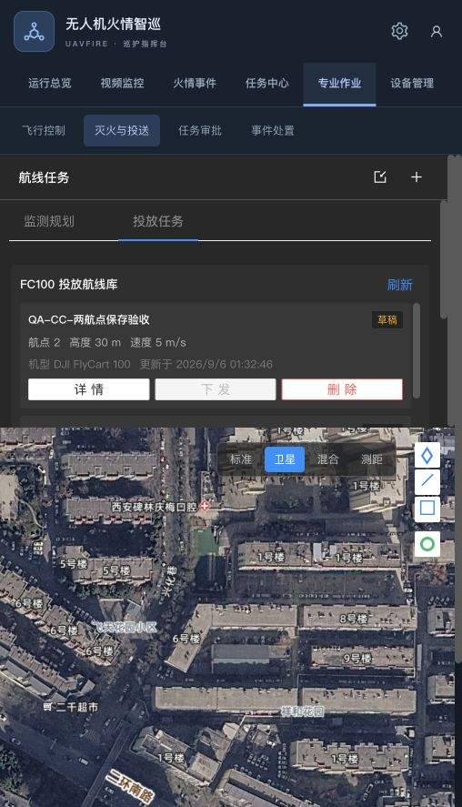
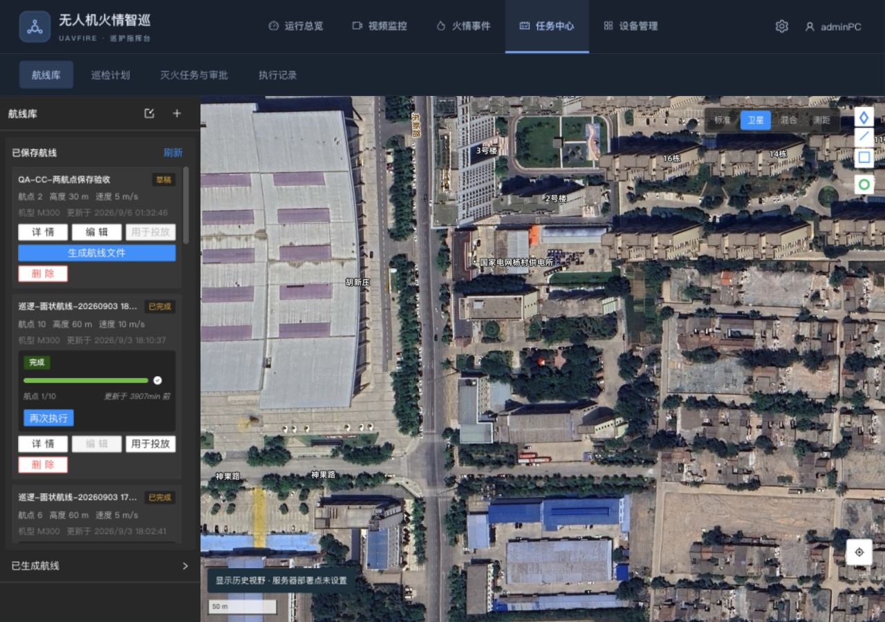
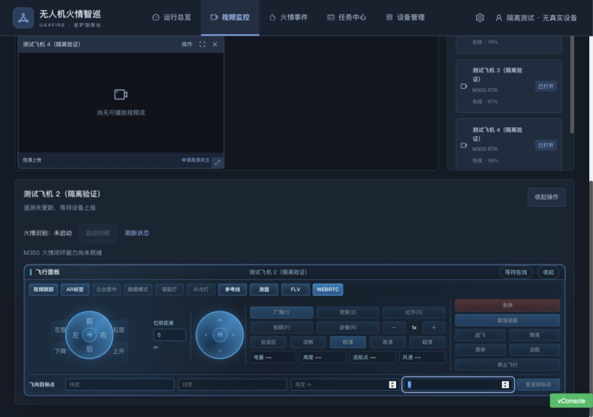

# 入口与职责合并修订

2026-09-06，根据实际试用反馈实施。原专业作业将旧驾驶舱和同一批航线另设入口，造成重复。本次按业务职责合并。

## 当前结构

| 主栏目 | 负责内容 |
| --- | --- |
| 运行总览 | 唯一综合态势首页、待办和异常 |
| 视频监控 | 画面、观看档位、所选飞机的飞行/云台/相机操作及识别启停 |
| 火情事件 | 发现、复核、现场证据和事件处置 |
| 任务中心 | 航线库、巡检计划、灭火任务与审批、执行记录 |
| 设备管理 | 台账、状态、维护与固件 |

专业作业主栏目已移除。旧 `/flight-control` 转到 `/video-monitor`；旧驾驶舱源码供追溯，正式路由不再加载。旧 `/wayline?view=delivery` 初次进入时转到统一航线库。规划深链仍能打开创建对话框，新建/导入是航线库中的操作。

## 航线重复根因与修复

原监测与FC100列表共用 plannedWaylinesData，后者固定显示 DJI FlyCart 100，导致M300航线被错误标识。现在一份目录显示实际机型；已有KMZ的航线卡片可点击“用于投放”，打开原FC100任务弹窗。未生成文件时禁用此操作。执行监控组件已有再次执行/取消按钮时，不在卡片底部重复显示。

投放保留原选设备、创建任务、执行与终端控制。本机设备池含 FC100_MOCK_* 记录，弹窗会带出原选择；本轮没有点击创建、开始执行或载荷动作，不能以这些记录作为实机证据。

## 控制迁移

DeviceOperations复用原CockpitFlightControlPanel，从视频窗口“操作”打开。关闭对应窗口同时关闭操作区；查看面板不启停源端视频，不发飞行命令。

实际控制要求15秒内有效高度遥测；离线、无时间戳、过期或缺少高度时禁用，不补默认电量/高度。M300识别启动保留fireClosedLoopReady门禁。后端识别状态缺少有效running字段时显示状态不可确认。请求序号防止旧状态覆盖新操作。

## 验证

| 检查 | 结果 |
| --- | --- |
| 前端回归 | 26个文件，175项通过，新增导航归属及遥测门禁覆盖 |
| ESLint及构建 | 新指挥台目录检查、Vite构建通过；既有大chunk提示仍存在 |
| 旧投放深链 | 进入统一航线库，五主栏目、四个任务二级入口，测试航线显示M300 |
| 投放操作 | 有文件的航线打开原弹窗；没有执行创建/飞行 |
| 旧驾驶舱地址 | 转入视频监控，不再显示旧综合驾驶舱 |
| 规划深链 | 仍显示监测/投放及航点/巡逻/面状创建选项 |
| 视频操作区 | 隔离环境打开并展开；遥测缺失时起飞、返航和启动识别禁用；关窗后控制区消失 |
| 后端 | 本修订未修改后端；此前499项结果属于前次基线，本轮未重跑 |

新IA-01至IA-06用例见test-cases.md。真实飞机、遥控器、媒体与载荷验收仍待现场执行。

## 视觉证据

合并前的重复目录：

合并后的统一航线库：

视频内的飞机操作区，使用隔离测试设备：

本轮检查导航归属、单份目录、机型文案、操作可达与滚动，不对不同尺寸截图作像素相等结论。原地图和业务组件样式继续复用。
