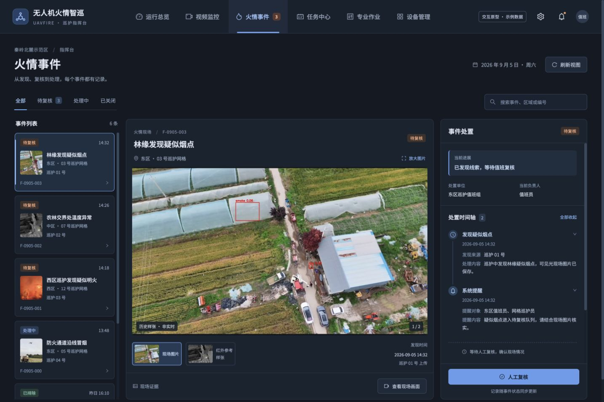
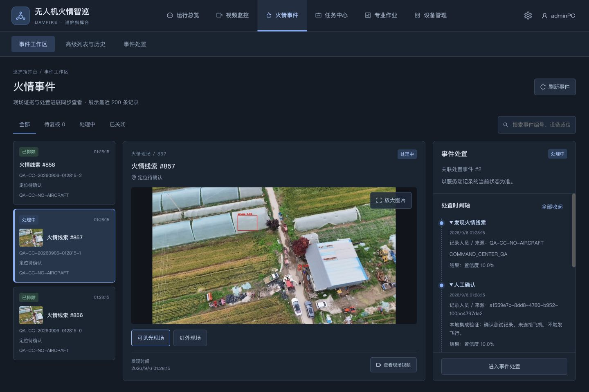

# 视觉审查及优化记录

> Current navigation update: [consolidation-report.md](consolidation-report.md). Six-section and legacy cockpit observations below are from the initial implementation.
审查对象：正式统一指挥台及原型，2026-09-06。审查采用真实浏览器截图和DOM尺寸，原型/实现同时查看；不把仅生成截图等同于完成审查。

## 结果

火情工作区实现用户要求的窄列表、中央现场证据、右侧处置时间轴与详情。1440桌面保留三栏；1280仍可操作；390窄屏改为列表横滑与详情纵向排列。导航保留航线规划、任务、专业控制和平台管理入口。现场照片使用contain保持证据完整，允许黑边。

原型与实现并非逐像素复制：正式版增加业务二级导航；使用后端事件状态、真实编号/审核人和有效操作；不保留原型虚构的在线数量和人员姓名。上述差异为落地所需。真实业务时间轴节点数量不同，因此重点比对布局、可读性和操作位置。

## 同视口对照

原型（CSS视口1440×960；浏览器截图输出1434×956）：

正式实现（1440×960）：

对照观察：深蓝背景/蓝色选择态、边框卡片、现场图及时间轴视觉层级一致；左栏明显收窄，中央随宽度伸展，右栏保持可读宽度。图片未拉伸，编号换行/截断不侵占主要按钮。时间轴自身可滚动，底部操作可达。

## 问题、修改与复测

| 问题 | 级别 | 修改 | 复测证据 |
| --- | --- | --- | --- |
| 顶栏/长事件编号占宽，影响导航与待办可读性 | P2 | 导航居中弹性宽度，编号溢出控制，保留账户按钮 | 13、16、17 |
| 三栏高度加二级导航后超出首屏 | P2 | 按真实视口及页头计算可用高度，详情内部滚动 | 13、16 |
| 航线库高度沿用旧侧栏导致仅显示一小块 | P2 | 根据父容器高度更新列表/地图尺寸 | [06规划保存](evidence/06-planner-saved.jpg) |
| 窄屏工具栏、标题按钮拥挤 | P2 | 工具栏换行、导航可滑、事件列表横向排列 | [09现场图](evidence/09-events-mobile.jpg)、[11时间轴](evidence/11-events-mobile-timeline.jpg) |
| 多窗口舞台底部超出，手机按钮挤压 | P2 | 调整舞台高度与移动布局，窗口约束边界 | [08视频小屏](evidence/08-video-mobile.jpg) |
| 数据失败时多个toast遮挡页面 | P2 | 分来源错误面板，抑制重复通知，保持401处理 | [10故障态](evidence/10-overview-service-failure.jpg)、[18恢复](evidence/18-overview-recovered.jpg) |
| 执行记录使用亮色表格，与指挥台背景突兀 | P2 | 仅执行页增加暗色表头/行/分页样式，旧设备管理不受影响 | [19执行页复测](evidence/19-execution-history-refined.jpg) |
| 旧管理模块部分英文、不同表格主题 | P3 | 本轮保留既有功能外观，后续独立统一文案与主题 | [15设备管理](evidence/15-devices.jpg) |

## 响应式结果

| CSS视口 | 观察 |
| --- | --- |
| 1440×960 | 左列表、现场图、处置详情同屏；图片完整，核心按钮可见 |
| 1280×900 | 三栏成立；实际document.scrollWidth=1280；空图明确呈现，长审核人可换行 |
| 1792×900 | 中栏扩展、左右固定；实际document.scrollWidth=1792；截图工具仅捕获左侧1748像素，右侧边界以DOM尺寸核验（详情栏right=1760，页面宽1792） |
| 390×844 | document.scrollWidth=390；主导航横滑、事件卡片横滑；照片及时间轴纵向可达 |

[1280截图](evidence/16-events-1280.jpg) · [1792截图](evidence/17-events-1792.jpg) · [规划保存](evidence/06-planner-saved.jpg) · [执行记录](evidence/19-execution-history-refined.jpg)

桌面优先的原专业控制和管理页面并未完成全手机操作验收；视频fixture不提供实流，真实画面分辨率、播放延迟与16窗口负载不在视觉通过范围内。已审核心界面未发现遗留P0/P1/P2阻断问题，P3旧模块一致性项保留记录。
