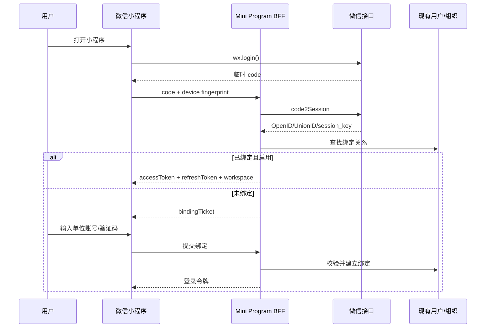
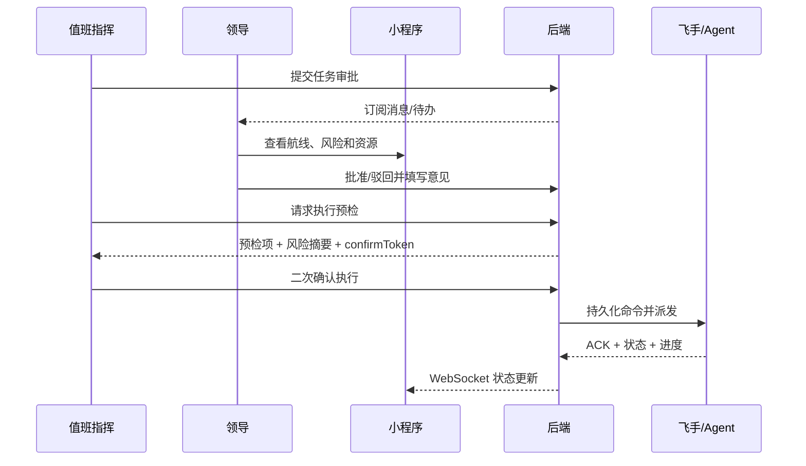
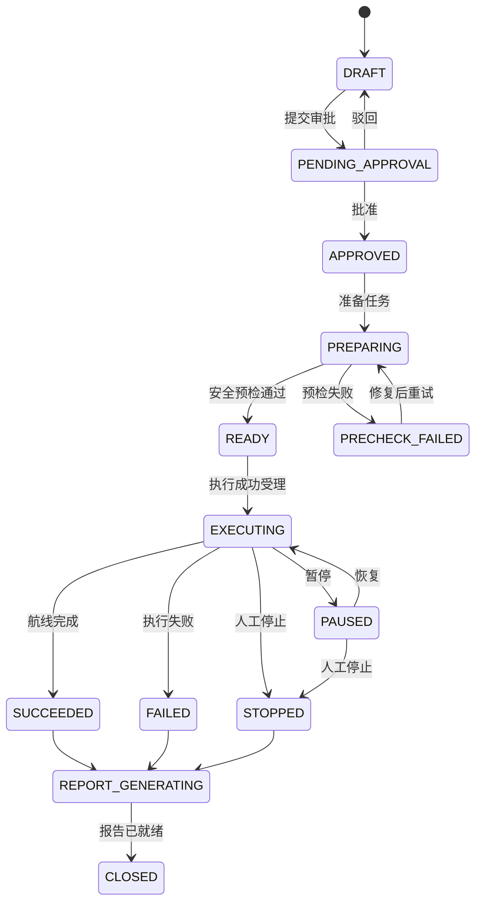

# 无人机火情智巡微信小程序——产品与业务设计

## 1. 产品定义

### 1.1 产品名称

暂定名称：**无人机火情智巡**。

### 1.2 产品定位

为领导、值班指挥、飞手和巡检人员提供移动端态势查看、任务协同、异常处置、
报告签阅和通知入口。产品强调“看得清、叫得动、追得上、能闭环”，不替代
专业 PC 航线编辑器、DJI Pilot 2 或遥控器。

### 1.3 产品目标

- 领导在 30 秒内了解当天巡检、设备、火情和待办态势。
- 高等级异常在事件入库后 60 秒内触达已订阅且具备权限的责任人。
- 从异常发现到责任人接受任务形成全链路时间线。
- 任务完成后自动汇总航迹、媒体、异常、设备和操作证据，生成可签阅报告。
- 所有高风险操作都能回答“谁、何时、在哪个组织、对哪架飞机、基于什么条件、执行结果如何”。

### 1.4 非目标

- 不在小程序中提供虚拟摇杆、连续云台控制或手工航点精细编辑。
- 不通过小程序绕过飞手、遥控器或 DJI 官方飞行安全能力。
- 不把本地空域参考数据描述为正式 UOM/USS 自动审批结果。
- 不允许 AI 自动确认真实火情、自动批准起飞或自动执行投放。
- 不把代码、构建或接口可调用等同于 M300 真机与实飞验收。

## 2. 用户与权限

### 2.1 角色

| 角色 | 核心诉求 | 默认权限 |
| --- | --- | --- |
| `LEADER` 领导 | 看全局、批示、审批、催办、签阅报告 | 全局只读、审批、批示、督办、报告签阅；无直接飞行执行权 |
| `DUTY_COMMANDER` 值班指挥 | 处置告警、组织任务、协调资源 | 创建处置单、分派、发起飞行操作、暂停/停止任务 |
| `PILOT` 飞手 | 确认飞行条件、执行与接管 | 确认起飞、执行航线、暂停/恢复/停止、现场反馈 |
| `INSPECTOR` 巡检人员 | 查看任务、标记问题、提交整改证据 | 任务查看、问题登记、图片上传、整改提交 |
| `AUDITOR` 安全/审计 | 合规检查、追溯、导出 | 全量只读、审计检索、报告导出 |
| `ADMIN` 系统管理员 | 人员、组织、模板和权限管理 | 配置管理；不得默认拥有飞行控制权 |

### 2.2 权限原则

- 用户只访问令牌绑定的 `workspaceId` 和数据范围；客户端传入的组织 ID 不作为授权依据。
- 角色、数据范围和操作权限分离，例如领导可以看全局，但不自动拥有 `flight:execute`。
- `EXECUTE`、`STOP`、`RETURN_HOME` 等操作需业务权限、任务权限和设备权限同时满足。
- 管理员配置权和飞行控制权分离，避免单一账号拥有全部关键权限。
- 所有拒绝也写审计，保留设备、任务、风险条件和拒绝原因。

### 2.3 建议权限码

```text
dashboard:read
task:read
task:approve
task:execute
task:pause
task:resume
task:stop
task:return-home
event:read
event:review
incident:assign
issue:create
issue:handle
issue:recheck
report:read
report:generate
report:sign
report:share
device:read
audit:read
admin:manage
```

## 3. 产品范围与版本规划

### 3.1 MVP / P0

- 微信登录、账号绑定、工作空间选择、基础 RBAC。
- 今日态势、待办、任务列表和任务详情。
- 已发布航线浏览、任务进度、航迹和设备状态。
- 高等级火情/AI异常列表、详情和人工复核。
- 受控的执行、暂停、恢复、停止操作；返航先做“请求飞手返航”。
- 自动巡检报告生成、查看、下载和签阅。
- 微信订阅消息：高等级告警、任务失败、报告生成、待审批、超时督办。
- 操作审计、灰度开关和紧急降级为只读。

### 3.2 P1

- 任务审批流、跨部门分派、督办、整改和复检闭环。
- 直播、相机切换和断流降级快照。
- 周报/月报、区域趋势、设备利用率和误报率分析。
- 设备战备、飞手资质、电池和载荷提醒。
- 报告模板配置、报告分享口令和水印。

### 3.3 P2

- 多组织联合指挥、事件协同群和外部观察员临时授权。
- 语音批示转文字、智能摘要和自然语言查询。
- 预测性维护、重点区域巡检建议、任务资源智能推荐。
- 在完成专项安全评审后评估受控返航直接执行；仍不提供虚拟摇杆。

## 4. 信息架构

### 4.1 一级导航

首版采用五个 Tab：

| Tab | 主要内容 | 首屏动作 |
| --- | --- | --- |
| 首页 | 今日指标、风险、待办、快捷入口 | 查看最紧急事项 |
| 任务 | 巡检任务、航线、实时进度 | 筛选、进入任务、发起受控操作 |
| 态势 | 地图、设备、火情、航迹、直播 | 切换图层、查看事件或设备 |
| 报告 | 自动报告、签阅、分享、统计 | 查看最新报告、完成签阅 |
| 我的 | 身份、组织、订阅、值班、设置 | 管理通知授权与账号绑定 |

### 4.2 页面清单

| 编号 | 页面 | P0 | 核心状态 |
| --- | --- | --- | --- |
| MP-01 | 登录/账号绑定 | 是 | 未绑定、待审核、已绑定、禁用 |
| MP-02 | 今日态势首页 | 是 | 正常、需关注、数据延迟、部分异常 |
| MP-03 | 待办中心 | 是 | 待审批、待处置、待复检、超时 |
| MP-04 | 任务列表 | 是 | 全部、待审批、待执行、执行中、异常、完成 |
| MP-05 | 任务详情 | 是 | 计划、预检、执行、媒体、问题、报告 |
| MP-06 | 航线预览 | 是 | 航点/面状测区、起降点、风险图层 |
| MP-07 | 飞行操作确认 | 是 | 风险预览、二次确认、等待回执、结果 |
| MP-08 | 火情/异常列表 | 是 | 待复核、已确认、误报、处置中、关闭 |
| MP-09 | 火情/异常详情 | 是 | 证据、坐标、历史、关联任务、处置动作 |
| MP-10 | 态势地图 | 是 | 地图、航迹、事件、设备、数据新鲜度 |
| MP-11 | 实时直播 | P1 | 加载、播放、弱网、断流、无权限 |
| MP-12 | 问题/督办单 | P1 | 新建、已分派、处理中、待复检、关闭 |
| MP-13 | 报告列表 | 是 | 生成中、可查看、失败、已签阅、归档 |
| MP-14 | 报告详情 | 是 | 摘要、地图、问题、证据、签阅 |
| MP-15 | 统计简报 | P1 | 日/周/月、区域、组织、设备 |
| MP-16 | 设备战备 | P1 | 在线、低电量、告警、维护、不可出动 |
| MP-17 | 通知设置 | 是 | 未授权、已授权、被拒绝、模板不可用 |
| MP-18 | 审计详情 | 是 | 请求、审批、命令、回执、操作者 |

## 5. 首页设计

### 5.1 首屏优先级

1. 紧急事件和超时事项。
2. 执行中任务及异常状态。
3. 今日关键指标。
4. 在线设备和最低电量。
5. 最新报告和趋势。

### 5.2 首页卡片

- **结论条**：`运行正常`、`3 项需要关注`、`存在高等级火情`。
- **今日巡检**：计划、执行中、完成、失败。
- **活跃火情**：总数、最高等级、待复核、处置中。
- **设备战备**：在线/总数、最低电量、不可出动数量。
- **待我处理**：审批、批示、复检、签阅和超时。
- **态势缩略图**：任务航迹、飞机、火点和重点区域。
- **最新动态**：最近 10 条关键事件，普通遥测不占用领导时间线。

### 5.3 数据新鲜度

每个实时卡片必须显示最近更新时间。建议口径：

- `FRESH`：最后更新 ≤ 10 秒。
- `DELAYED`：10 秒 < 最后更新 ≤ 60 秒。
- `STALE`：最后更新 > 60 秒。
- `UNKNOWN`：从未收到数据。

陈旧数据不得继续显示为“在线”或“执行中正常”。

## 6. 核心业务流程

### 6.1 登录与绑定



### 6.2 任务审批与执行



### 6.3 异常处置与督办

```text
AI/人员发现异常
  -> 事件去重与风险分级
  -> 人工复核
  -> 确认事件
  -> 创建问题/处置单
  -> 指定责任人和期限
  -> 处理人反馈和上传证据
  -> 巡检人员复检
  -> 关闭或重新打开
  -> 写入巡检报告和统计口径
```

### 6.4 报告生成

```text
任务进入终态
  -> 固化任务快照
  -> 收集航迹、媒体、异常、操作、设备和气象/空域留证
  -> 生成结构化报告数据
  -> 渲染 PDF
  -> 对文件计算 SHA-256 并存储
  -> 报告 READY
  -> 通知相关人员
  -> 签阅/分享/归档
```

## 7. 状态机

### 7.1 巡检任务状态



任务状态必须由后端状态机驱动，小程序不得根据按钮点击结果自行修改。

### 7.2 飞行指令状态

```text
CREATED -> VALIDATING -> QUEUED -> DISPATCHED -> ACKED -> EXECUTING
  -> SUCCEEDED | FAILED | TIMED_OUT | REJECTED | CANCELLED
```

`HTTP 202` 只表示已受理，不表示飞机已执行。最终结果以 Agent/MSDK 回执和状态事件为准。

### 7.3 问题整改状态

```text
NEW -> ASSIGNED -> IN_PROGRESS -> PENDING_RECHECK -> CLOSED
                                  -> REOPENED -> IN_PROGRESS
```

### 7.4 报告状态

```text
PENDING -> GENERATING -> READY -> SIGNED -> ARCHIVED
                    \-> FAILED -> PENDING
```

## 8. 飞行操作产品规则

### 8.1 操作分级

| 等级 | 操作 | 控制 |
| --- | --- | --- |
| L0 | 查看、筛选、下载报告 | 常规鉴权 |
| L1 | 复核异常、分派、批示、签阅 | 权限 + 审计 |
| L2 | 准备、执行、暂停、恢复 | 权限 + 任务版本 + 预检 + 二次确认 + 幂等 |
| L3 | 停止、返航、降落、释放、接管 | 专项权限 + 强二次确认 + 原因 + 飞手在场 + 设备回执 |

### 8.2 首版允许与禁止

- 允许：执行已审批任务、暂停、恢复、停止。
- 允许：向飞手发送返航请求，并显示是否接受。
- 条件开放：直接返航命令，需完成专项实飞和应急处置验证。
- 禁止：虚拟摇杆、任意坐标飞行、连续云台控制、远程载荷释放。

### 8.3 二次确认内容

- 任务名称、航线和目标区域。
- 无人机 SN、机型、载荷型号和载荷位置。
- 飞手、遥控器在线状态和当前控制权。
- 电量、RTK、GNSS、HMS、风速、空域与时间窗。
- 当前状态、请求动作、预期后果和不可逆风险。
- 确认有效期和操作人身份。

## 9. 报告产品设计

### 9.1 报告章节

1. 封面、报告编号、区域、时间、组织和结论。
2. 任务计划与执行摘要。
3. 航线地图、实际航迹、覆盖范围和完成率。
4. 飞机、载荷、飞手、电池与关键遥测摘要。
5. 异常和火情清单，含位置、等级、证据和处置状态。
6. 现场照片、视频关键帧和 AI 辅助结论。
7. 问题整改、责任人、期限和复检结果。
8. 合规留证、审批、起降确认和关键操作审计。
9. 结论、建议、签阅记录和附件清单。

### 9.2 报告原则

- 报告生成使用任务终态时的数据快照，后续业务数据变化不修改历史版本。
- AI 文本必须标注“AI 辅助生成”，事实字段来自结构化数据，不由模型编造。
- 报告每次重生成形成新版本，旧版本保留并可追溯。
- 文件保存 SHA-256、生成器版本、模板版本和数据快照版本。
- 分享链接短时有效、可撤销、带水印并记录访问。

## 10. 通知策略

### 10.1 通知事件

| 事件 | 默认对象 | 紧急度 | 合并/抑制 |
| --- | --- | --- | --- |
| 高等级火情 | 领导、值班指挥、飞手 | 紧急 | 同一事件升级时重发，普通复报合并 |
| 任务审批 | 审批人 | 普通 | 同任务同审批节点只保留一条待办 |
| 任务失败/停止 | 指挥、飞手、创建人 | 高 | 状态变化触发一次 |
| 设备离线/低电量 | 值班指挥、飞手 | 高 | 5 分钟窗口聚合；恢复发送恢复通知 |
| 报告就绪 | 创建人、签阅人 | 普通 | 每版本一次 |
| 督办超时 | 责任人、上级 | 高 | 到期、超时 24h 分级升级 |

### 10.2 送达规则

- 微信订阅消息需要用户主动授权；拒绝授权时保留站内待办，不得静默丢失。
- 重要事件采用“站内消息 + 微信订阅消息 + 可选短信/电话”的多通道策略。
- 发送失败按指数退避重试，并记录微信返回码、模板、OpenID、业务键和最终状态。
- 夜间免打扰不适用于用户明确订阅的紧急火情，但仍需符合组织通知制度。

## 11. 指标与验收

### 11.1 产品指标

- 首页关键数据成功率 ≥ 99.9%。
- 任务状态端到端延迟 P95 ≤ 5 秒。
- 高等级告警入库到通知任务创建 P95 ≤ 10 秒。
- 报告生成成功率 ≥ 99%，普通任务 P95 ≤ 3 分钟。
- 高风险命令重复点击导致重复执行次数必须为 0。
- 越权访问、跨 workspace 数据泄漏和客户端伪造 workspace 成功次数必须为 0。

### 11.2 用户验收场景

1. 领导打开首页，在 30 秒内说出今日任务、活跃火情和最紧急待办。
2. 值班指挥从异常详情创建处置单并分派，责任人在微信中收到通知。
3. 飞手完成任务执行二次确认，领导只查看状态而不能越权执行。
4. 弱网重复点击执行按钮，系统只生成一个指令并返回同一结果。
5. Agent 离线时执行请求被明确拒绝，不能显示“已起飞”。
6. 任务结束后自动生成带航迹、异常、证据和审计的报告。
7. 报告签阅后仍可核验原文件哈希和历史版本。
8. 用户切换组织时，不能看到前一组织的数据缓存。

## 12. 文案与可用性规范

- 使用业务语言：`任务已受理，等待飞机回执`，不要只显示 `HTTP 202`。
- 风险按钮写清后果：`停止任务并保持悬停`、`请求飞手返航`。
- 颜色不是唯一状态表达，同时使用文字、图标和时间。
- 所有地图点位显示坐标来源、精度和更新时间。
- 空状态说明下一步；错误状态提供重试、联系值班人员或切换只读方案。
- 页面返回前保留筛选和滚动位置；高风险确认页返回即使 confirmToken 失效。
