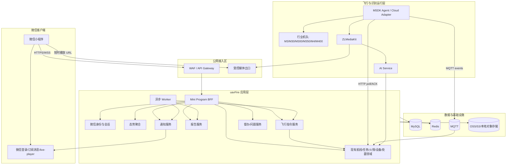
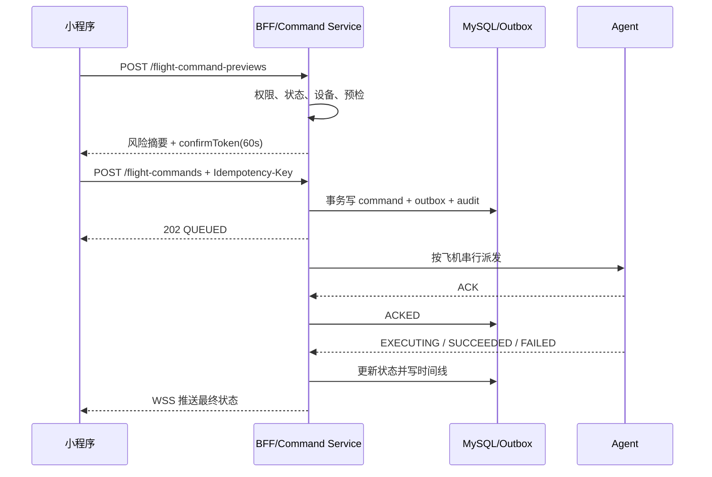

# 无人机火情智巡微信小程序——详细技术方案

## 1. 设计目标

本方案在现有 uavFire 后端、多机型 MSDK/Cloud 适配器、AI 服务、
ZLMediaKit 和 PC 驾驶舱基础上增加微信小程序移动入口。当前 M300 分支
只是代码基线，运行架构覆盖 M3 行业系列、M30、M300/M350、M3D、M4、
M400 及后续经适配的行业机型。核心原则：

1. **单一事实源**：航线、任务、设备、火情和处置状态仍由现有后端领域模型维护。
2. **移动端聚合**：新增 Mini Program BFF，向小程序提供稳定、低往返、面向页面的接口。
3. **安全优先**：高风险飞行操作先预检、再确认、后入持久化队列，最终以设备回执为准。
4. **异步解耦**：报告、通知、媒体处理和指令派发使用事务事件/Outbox，避免请求线程承担长任务。
5. **可降级**：视频不可用时仍可查看地图、快照、状态和任务时间线；控制异常时一键切只读。
6. **证据可追溯**：关键状态、审批、指令、回执、报告和分享均有不可抵赖的审计链。

## 2. 现状评估

### 2.1 可复用模块

| 现有模块 | 可复用能力 | 小程序接入方式 |
| --- | --- | --- |
| `wayline` | 航线计划、KMZ、发布、准备、执行、进度、断点 | BFF 调用领域 Service，不从小程序直连 Controller |
| `wayline.agent` | Agent 鉴权、命令、ACK、状态与进度事件 | 增加持久化队列和命令投影 |
| `msdk` / `manage` | 设备、能力、OSD/HMS、直播控制 | 聚合成设备摘要和实时事件 |
| `fc100.event` | 火情事件、证据、定位质量、复核 | 聚合为移动端异常中心 |
| `fc100.operation` | 事件处置、分配、时间线、预检、合规留证 | 复用状态机，扩展督办与签阅 |
| `media` | 航线媒体、上传进度、对象存储 | 生成短时授权预览 URL |
| `frontend leadership-cockpit` | 指标口径、态势图层、设备/火情摘要 | 复用指标定义，不复用 Vue 页面代码 |
| `ai-service` | 可见光火情检测、快照、事件上报 | 只作为事件来源，不对小程序直连 |
| ZLMediaKit | RTMP/RTSP/WebRTC 媒体中枢 | 增加公网受控播放出口和短时鉴权 |

### 2.2 必须整改的技术债

- `WaylineAgentServiceImpl` 使用
  `ConcurrentHashMap<String, WaylineAgentCommandDTO>` 保存每架飞机唯一待处理命令；
  服务重启丢失，新命令会覆盖旧命令。
- 当前 WebSocket 可在 URL 参数携带令牌，并存在打印 token 的调试日志；新小程序链路不得复用此方式。
- 当前用户登录以账号密码和 JWT 为主，缺少微信身份绑定、设备会话、刷新令牌轮换和统一 RBAC。
- 当前没有通用巡检报告聚合、版本化和异步生成领域。
- 当前没有微信订阅授权和消息送达记录。
- 驾驶舱对系统链路健康主要依据最近接口请求，缺少统一健康汇总接口。
- 多个 Agent 路径仍存在 M300 专用判断或非 M300 默认拓扑；在逐机型整改和实机/实飞验收前，小程序不得扩大未验证能力的暴露面。

## 3. 总体架构



### 3.1 部署建议

首期采用现有 Spring Boot 单体内模块化实现，避免过早拆微服务：

```text
backend/uavfire
  com.yx.uavfire.miniapp.auth
  com.yx.uavfire.miniapp.dashboard
  com.yx.uavfire.miniapp.task
  com.yx.uavfire.miniapp.event
  com.yx.uavfire.miniapp.issue
  com.yx.uavfire.miniapp.report
  com.yx.uavfire.miniapp.notification
  com.yx.uavfire.miniapp.command
  com.yx.uavfire.miniapp.audit
```

报告 Worker 和通知 Worker 初期可在同一进程以独立线程池运行，但必须通过数据库 Outbox 领取任务；后续可平滑拆为独立进程。

小程序建议目录：

```text
miniprogram/
  src/api
  src/components
  src/pages
  src/store
  src/services
  src/utils
  src/types
  src/config
  tests
```

如团队希望复用 Vue 3/TypeScript 经验，可采用 uni-app + Vue 3。实时地图、
`live-player`、订阅消息和授权必须通过微信真机验证，不以 H5 行为替代验收。

## 4. 模块设计

### 4.1 微信身份与会话模块

职责：

- 接收 `wx.login()` 临时 code，服务端调用微信 `code2Session`。
- 将 `OpenID`/可选 `UnionID` 映射到现有用户与 workspace。
- 未绑定用户签发短时 `bindingTicket`，完成账号/组织绑定后签发业务令牌。
- 签发 15 分钟 access token 和最长 7 天、每次使用轮换的 refresh token。
- 记录设备会话、最后访问、风险状态、撤销时间和 refresh token 哈希。
- 禁止把 `session_key`、AppSecret、refresh token 明文写入日志或数据库。

建议令牌 Claim：

```json
{
  "sub": "system-user-id",
  "sid": "miniapp-session-id",
  "workspaceId": "workspace-id",
  "roles": ["LEADER"],
  "permissions": ["dashboard:read", "report:sign"],
  "channel": "WECHAT_MINIAPP",
  "iat": 1788412800,
  "exp": 1788413700
}
```

### 4.2 Mini Program BFF

职责：

- 将多个后端领域查询聚合成小程序页面模型。
- 统一字段命名、分页、坐标、时间、权限裁剪和数据新鲜度。
- 不复制领域状态机，不直接写现有业务表。
- 对任务详情、态势和设备摘要提供短缓存；对权限和命令不缓存。
- 维护 `/miniapp/api/v1` 版本契约，与 PC Controller 解耦。

缓存建议：

| 数据 | TTL | 失效策略 |
| --- | --- | --- |
| 首页摘要 | 5 秒 | 火情/任务/设备关键事件主动失效 |
| 任务列表 | 10 秒 | 任务状态变化主动失效 |
| 航线详情 | 60 秒 | 航线发布/修改主动失效 |
| 设备摘要 | 3 秒 | OSD/HMS 事件覆盖 |
| 报告详情 | 60 秒 | 版本/签阅变化主动失效 |
| 权限 | 不做页面缓存 | 每次令牌签发加载，关键操作再次查验 |

### 4.3 态势聚合模块

聚合以下事实：

- 火情/AI事件：活跃数量、最高等级、待复核、定位质量和关联任务。
- 巡检任务：计划、待审批、执行中、异常、完成。
- 飞机：在线状态、任务状态、最低电量、载荷和 HMS。
- 直播：会话、协议、数据新鲜度，不将“URL 存在”当成播放在线。
- 待办：审批、批示、整改、复检、报告签阅和超时。

聚合结果携带：

```json
{
  "dataStatus": "FRESH",
  "generatedAt": 1788412800000,
  "partial": false,
  "warnings": []
}
```

任一子服务失败时允许返回 `partial=true`，同时明确缺失项；不得用零值冒充真实无数据。

### 4.4 持久化飞行指令模块

#### 4.4.1 目标

- 每个指令有稳定 `commandId` 和业务 `idempotencyKey`。
- 同一飞机按序派发，互斥动作不能并发。
- API 受理、Agent ACK、MSDK 执行和最终状态分开记录。
- 服务重启、Agent 离线或网络重试不丢指令、不重复执行。

#### 4.4.2 指令流程



#### 4.4.3 互斥与版本

- `aircraft_sn + active=true` 唯一约束，保证每架飞机最多一个执行中互斥指令。
- 请求携带 `expectedTaskVersion`，与任务当前版本不一致返回 `409 TASK_VERSION_CONFLICT`。
- `confirmToken` 绑定用户、会话、workspace、任务、飞机、动作、风险快照和过期时间；任何字段变化均失效。
- `Idempotency-Key` 在同一用户、同一操作资源下保存 24 小时；相同键不同请求体返回冲突。
- 高风险命令不自动跨过期时间重试；超时后必须重新预检和人工确认。

#### 4.4.4 派发策略

- Worker 通过 `SELECT ... FOR UPDATE SKIP LOCKED` 领取命令。
- 每架飞机一个顺序键；调度前再次检查设备在线、任务状态和控制权。
- 旧 Agent HTTP poll 仍可读取命令，但数据源改为数据库队列。
- ACK 仅表示 Agent 已接收；最终成功必须由 MSDK 事件确认。
- `STOP` 可提升队列优先级，但不能覆盖旧命令；需显式将被中止命令置为 `CANCEL_REQUESTED/CANCELLED`。

### 4.5 巡检问题与督办模块

职责：

- 从火情事件、AI异常、人工标记或报告项创建问题。
- 保存等级、位置、证据、责任组织、责任人、期限和处置要求。
- 支持反馈、附件、转派、催办、复检、关闭和重新打开。
- 所有状态转换使用后端状态机并检查版本号。
- 超时扫描通过 Outbox 创建升级通知，不在定时任务中直接调用微信。

### 4.6 报告模块

#### 4.6.1 生成架构

```text
TaskTerminalEvent
  -> inspection_report(PENDING)
  -> report_generation_job
  -> 固化 JSON snapshot
  -> 模板渲染 HTML
  -> Chromium/受控渲染器输出 PDF
  -> SHA-256 + 页数 + 大小
  -> OSS
  -> inspection_report(READY)
  -> NotificationRequestedEvent
```

#### 4.6.2 数据一致性

- 以 `taskId + reportType + version` 唯一。
- 快照包含所有引用对象的稳定 ID、展示值和采集时间。
- 生成失败不改变任务终态，报告可按同一快照重试。
- 重生成创建新版本；不得覆盖已签阅或已分享版本。
- PDF 与结构化 JSON 均保存哈希，便于审计和重新渲染比对。

#### 4.6.3 AI 摘要

- 默认采用规则模板生成结论，确保字段可解释。
- 若引入 LLM，只能基于已固化快照生成草稿；输出需事实校验并标注 AI 辅助。
- 模型不可新增快照中不存在的设备、坐标、风险结论或审批事实。

### 4.7 通知模块

职责：

- 保存用户对模板的授权结果和更新时间。
- 将领域事件映射为站内待办、微信订阅消息及可选短信/电话任务。
- 基于 `eventType + businessId + notificationVersion + recipient` 去重。
- 对发送失败执行指数退避，区分永久错误和临时错误。
- 接收微信异步发送结果事件并更新送达状态。
- 消息只包含最少必要信息；敏感详情需打开小程序并重新鉴权查看。

建议重试：1 分钟、5 分钟、15 分钟、1 小时；模板无权限、OpenID 无效、用户拒收等永久错误不重试。

### 4.8 实时事件模块

- 小程序先调用 `POST /realtime-tickets` 获取 60 秒有效、一次性的 ticket。
- 使用 `wss://.../miniapp/ws?ticket=...` 建立连接，URL 不携带 access token。
- 服务端消费 ticket 后绑定用户、workspace、权限和会话。
- 心跳 25 秒，60 秒无心跳关闭。
- 客户端使用 `eventId` 去重，断线后携带 `Last-Event-Id`/游标补拉关键事件。

事件信封：

```json
{
  "eventId": "evt_01J...",
  "eventType": "TASK.PROGRESS_UPDATED",
  "workspaceId": "ws-001",
  "occurredAt": 1788412800123,
  "resourceType": "INSPECTION_TASK",
  "resourceId": "task-001",
  "version": 18,
  "data": {}
}
```

普通 OSD 高频数据可只推最新值；任务状态、命令结果、火情和审计事件不得静默丢弃。

### 4.9 直播模块

现有驾驶舱以 WebRTC/ZLM 为主。微信小程序 `live-player` 接入前需要验证类目权限、协议支持、公网可达性和真机行为。

推荐策略：

1. BFF 创建短时直播会话，校验用户对目标飞机的查看权限。
2. 媒体网关返回 60–120 秒短时播放 URL，不暴露 ZLM 管理密钥。
3. 小程序前台播放；退后台或断流时自动切换最近快照和遥测。
4. 播放状态由播放器事件和媒体网关共同判断，不能仅依据 Agent `isStreaming=true`。
5. 所有观看行为记录用户、飞机、任务、开始/结束和结果，但不记录播放密钥。

直播不是飞行安全操作的反馈唯一来源。关键指令必须依赖设备状态与回执，而不是依赖用户是否看见视频。

## 5. 数据设计

### 5.1 复用表

- `planned_wayline`：计划航线及实时任务投影。
- 现有 wayline job/file/media 表：发布任务、文件和媒体。
- `fire_event` 及处置相关表：火情、证据、坐标和状态。
- MSDK 设备和工作空间用户相关表。
- FC100 operation/mission/compliance 表。

复用表只通过现有领域 Service 访问，不从 miniapp Mapper 跨域直接更新。

### 5.2 新增表

#### `miniapp_user_binding`

| 字段 | 类型 | 说明 |
| --- | --- | --- |
| `id` | bigint PK | 主键 |
| `binding_id` | varchar(36) UK | 对外 ID |
| `user_id` | varchar(64) | 现有用户 ID |
| `workspace_id` | varchar(64) | 工作空间 |
| `openid_ciphertext` | varbinary | OpenID 加密存储 |
| `openid_hash` | char(64) | 查询用 HMAC/SHA-256 |
| `unionid_ciphertext` | varbinary nullable | 可选 UnionID |
| `status` | varchar(24) | PENDING/ACTIVE/DISABLED/REVOKED |
| `created_at/updated_at` | bigint | 毫秒时间戳 |

唯一索引：`(workspace_id, openid_hash)`、`(user_id, workspace_id, status)`。

#### `miniapp_session`

保存 `session_id`、用户、绑定、设备摘要、refresh token 哈希、过期、轮换序号、
撤销状态、最近 IP/UA 和风险标记。refresh token 只能使用一次，轮换重放应撤销
整个 token family。

#### `flight_command`

| 字段 | 说明 |
| --- | --- |
| `command_id` | 稳定业务 ID |
| `workspace_id/task_id/aircraft_sn` | 授权与关联对象 |
| `action` | EXECUTE/PAUSE/RESUME/STOP/RETURN_HOME_REQUEST/RETURN_HOME |
| `status` | 指令状态机 |
| `priority` | 普通/紧急 |
| `idempotency_key/request_hash` | 防重复及请求一致性 |
| `expected_task_version` | 乐观锁 |
| `confirm_snapshot_json` | 二次确认风险快照 |
| `requested_by/reason/source` | 操作者与原因 |
| `agent_tid/ack_result/result_json` | Agent/MSDK 回执 |
| `queued_at/dispatched_at/acked_at/finished_at/expires_at` | 生命周期时间 |
| `version` | 乐观锁版本 |

索引：`(aircraft_sn,status,priority,created_at)`、`(task_id,created_at)`、唯一 `(workspace_id,requested_by,idempotency_key)`。

#### `inspection_issue`

保存问题 ID、来源、任务、事件、等级、标题、描述、WGS84/GCJ02 位置、责任组织/人、期限、状态、版本、创建/关闭信息。

#### `inspection_issue_action`

追加式时间线，保存动作类型、前后状态、说明、附件、操作者和时间。不得原地覆盖历史动作。

#### `inspection_report`

保存报告 ID/编号、任务、类型、版本、状态、模板版本、快照对象键/哈希、PDF 对象键/哈希、页数、大小、生成错误、生成/签阅/归档信息。

#### `report_signature`

保存报告版本、签阅人、决定、意见、签阅时间、文件哈希和审计事件 ID。报告文件变化后旧签阅不自动继承。

#### `notification_subscription`

保存用户、工作空间、微信模板 ID、业务事件类型、授权状态、授权来源和更新时间。OpenID 通过 binding 间接关联。

#### `notification_delivery`

保存通知 ID、业务去重键、收件人、通道、模板、状态、尝试次数、下次重试、提供方消息 ID/错误码、发送/送达时间。

#### `domain_outbox`

保存事件 ID、聚合类型/ID、事件类型、负载、状态、重试次数、下次执行时间和创建时间。业务事务与 outbox 插入必须同事务提交。

#### `security_audit_log`

追加式保存操作者、会话、工作空间、动作、资源、请求 ID、幂等键、结果、失败码、IP/UA 摘要、前后状态哈希和时间。

### 5.3 坐标规范

- 后端事实坐标统一存 WGS84。
- 小程序腾讯地图展示使用 GCJ-02，由后端统一转换并同时返回 `wgs84` 与 `gcj02`。
- 报告必须标注坐标系、定位来源、精度半径、采集时间和转换版本。
- `(0,0)`、过期 OSD 或无定位解数据不得作为有效位置。

### 5.4 时间规范

- API 时间统一为 UTC ISO-8601，例如 `2026-09-03T07:30:00.123Z`。
- 数据库可沿用 epoch 毫秒，但 DTO 层统一转换。
- 报告展示按 `Asia/Shanghai`，同时保留原始 UTC 时间。

## 6. 安全设计

### 6.1 网络边界

- 小程序只访问经备案和微信后台配置的 HTTPS/WSS 域名。
- API Gateway 终止 TLS、限流、WAF、防重放和请求体大小限制。
- 后端、MySQL、Redis、MQTT、ZLM 管理接口和 Agent 接口不直接暴露公网。
- 媒体出口与业务 API 分域，使用短时签名 URL 和源站访问控制。

### 6.2 应用安全

- access token 放请求头，不放 URL、日志或前端埋点。
- refresh token 轮换、服务端哈希保存、设备会话可撤销。
- 所有对象查询先验证 workspace 和数据范围，防止 IDOR。
- 高风险操作强制服务端 RBAC、状态机、预检、confirmToken 和幂等。
- 上传文件校验 MIME、扩展名、魔数、大小和哈希，执行恶意文件扫描。
- 报告分享使用随机高熵 token、短有效期、访问次数限制、水印和撤销。
- 敏感字段脱敏；日志禁止记录密码、AppSecret、session_key、令牌和完整 OpenID。

### 6.3 高风险操作防护

执行、停止、返航等操作必须同时满足：

```text
有效登录会话
+ workspace/数据权限
+ 动作权限
+ 任务状态允许
+ expectedTaskVersion 一致
+ 设备与 Agent 在线且状态新鲜
+ 指定机型/载荷匹配
+ 安全预检通过
+ confirmToken 未过期且未使用
+ Idempotency-Key 有效
+ 飞手/控制权策略满足
= 才能进入 QUEUED
```

系统提供 `miniapp.flight-control.enabled` 总开关和按 workspace、用户、机型、
动作的细粒度灰度开关。紧急情况下可切只读，不影响 Agent 和 PC 端既有业务。

### 6.4 隐私与合规

- 首次登录展示隐私政策、数据用途和账号绑定说明。
- 仅收集提供服务所必需的微信标识、账号、设备会话和操作审计。
- 人脸、精确个人位置、通讯录等非必要信息不采集。
- 报告中的人员、坐标和媒体按组织制度确定保留期与下载权限。
- 数据删除需保留法定/安全审计边界，用户解绑不等于删除业务审计。

## 7. 可靠性与一致性

### 7.1 一致性策略

- 航线/任务状态：强状态机 + 乐观锁。
- 指令：事务表 + Outbox + 至少一次派发 + 消费端幂等。
- 通知：至少一次任务执行 + 业务去重。
- 报告：快照后最终一致，文件哈希校验。
- 首页聚合：允许部分成功，但必须显式标注 partial/warnings。

### 7.2 降级策略

| 故障 | 降级行为 |
| --- | --- |
| 微信接口不可用 | 保留站内待办，通知任务重试 |
| ZLM/直播不可用 | 显示最新快照、遥测、更新时间和联系电话 |
| WebSocket 断线 | 指数退避重连并 REST 补拉游标后的关键事件 |
| 报告渲染失败 | 保留结构化报告和失败原因，允许重试 |
| Agent 离线 | 禁止新飞行指令，已排队指令到期，不自动跨时段执行 |
| Redis 不可用 | 权限与命令不依赖缓存正确性；聚合回源并限流 |
| MySQL 主库异常 | 小程序切只读并显示系统维护，不受理高风险命令 |

### 7.3 目标指标

- API 可用性：月度 ≥ 99.9%。
- 普通查询：P95 ≤ 500ms；首页聚合 P95 ≤ 1.2s。
- 命令受理：P95 ≤ 1s；设备最终执行延迟单独统计。
- 实时状态端到端：P95 ≤ 5s。
- RPO：核心业务 ≤ 5 分钟；指令/审计/报告元数据目标 0。
- RTO：应用 ≤ 30 分钟；媒体降级不阻断任务与报告查看。

## 8. 可观测性

### 8.1 统一关联字段

每个请求、事件、命令和报告任务携带：

```text
requestId / traceId / workspaceId / userId / sessionId
taskId / aircraftSn / commandId / eventId / reportId
```

公开日志对用户、OpenID、IP 和设备 SN 按策略脱敏。

### 8.2 指标

- `miniapp_api_requests_total`、延迟、5xx、401、403、429。
- 活跃会话、登录/绑定失败、refresh token 重放。
- 首页聚合 partial 数量及子服务错误。
- 指令各状态数量、排队时间、ACK 延迟、最终成功率、超时和重复抑制。
- WebSocket 在线连接、重连、事件积压和补拉次数。
- 报告生成耗时、失败率、文件大小和重试。
- 通知授权率、发送/送达率、永久失败和重试积压。
- 直播会话创建、首帧时间、播放失败、断流和降级次数。

### 8.3 告警

- 高风险指令连续失败或同机型失败率突增。
- 指令 QUEUED 超过 30 秒、ACK 超时、最终状态长期未知。
- 报告 PENDING/GENERATING 积压。
- 通知失败率、微信 token 获取失败或模板失效。
- 首页聚合连续 partial、设备数据大面积陈旧。
- 认证异常、跨 workspace 拒绝激增、refresh token 重放。

## 9. 配置设计

新增配置建议：

```yaml
miniapp:
  enabled: false
  api-prefix: /miniapp/api/v1
  auth:
    access-token-ttl: 15m
    refresh-token-ttl: 7d
    binding-ticket-ttl: 10m
  wechat:
    app-id: ${WECHAT_MINIAPP_APP_ID}
    app-secret: ${WECHAT_MINIAPP_APP_SECRET}
  flight-control:
    enabled: false
    allowed-actions: [EXECUTE, PAUSE, RESUME, STOP]
    confirm-token-ttl: 60s
    command-ttl: 120s
  report:
    worker-enabled: true
    template-version: v1
  notification:
    worker-enabled: true
  realtime:
    ticket-ttl: 60s
  media:
    session-ttl: 120s
```

密钥只来自部署密钥管理系统或环境变量；示例配置不得提交真实值。

## 10. 发布拓扑

### 10.1 环境

- `dev`：微信开发版 + 测试账号 + 模拟设备，不连接真实飞行控制。
- `staging`：微信体验版 + 独立测试 workspace + 真机地面/桨叶拆除测试。
- `pilot`：限定 workspace、用户、飞机 SN 和动作的现场灰度。
- `prod`：正式小程序，按角色和组织开放。

环境数据库、微信模板、对象存储目录、域名、证书和消息队列必须隔离。

### 10.2 灰度顺序

```text
只读首页/任务/报告
  -> 微信登录与通知
  -> 火情复核与督办
  -> 直播查看
  -> 模拟指令
  -> 真机地面指令
  -> 无桨/系留/封闭场飞行
  -> 指定航线灰度
  -> 扩大组织与设备范围
```

## 11. 技术决策记录

| 决策 | 选择 | 原因 |
| --- | --- | --- |
| 客户端定位 | 领导移动驾驶舱 | 符合移动场景，减少误操作 |
| 航线编辑 | PC 端保留，小程序只浏览/审批/执行 | 手机不适合精细规划，降低风险 |
| 后端形态 | 现有单体内新增模块化 BFF | 复用领域能力、降低首期复杂度 |
| 实时连接 | 一次性 ticket 的 WSS | 避免 token 出现在 URL 与日志 |
| 指令保证 | MySQL 持久化队列 + Outbox | 服务重启不丢、顺序和审计明确 |
| 报告 | 快照 + 异步版本化 PDF | 可重现、可签阅、可审计 |
| 通知 | 站内待办为底座，微信订阅为通道 | 微信授权/模板不可作为唯一可靠链路 |
| 坐标 | WGS84 存储，GCJ-02 展示 | 保留飞行事实并适配腾讯地图 |
| AI 权限 | 只辅助发现与摘要 | 不承担安全关键决策 |

## 12. 待外部确认项

1. 小程序主体、服务类目和 `live-player` 权限是否可获批。
2. 订阅消息可申请的模板、一次性/长期能力和组织通知制度。
3. 公网域名、ICP备案、证书、WAF 和媒体出口资源。
4. 是否接入短信/语音电话作为高等级火情的备用通道。
5. 报告签阅是否属于内部确认，是否需要 CA/电子签章。
6. 现场允许小程序执行的动作清单，尤其是直接返航、降落和载荷操作。
7. 首批飞机、控制端/机场、载荷、固件组合清单和逐组合现场飞行验收计划。

多机型身份、能力分层、适配器注册表、当前代码差距和验收模板详见
[06-多机型兼容与验收](06-multi-aircraft-compatibility.md)。

## 13. 微信官方能力参考

- [小程序登录][wechat-login]：客户端 `wx.login` 与服务端 `code2Session` 的职责边界。
- [小程序订阅消息][wechat-subscribe]：用户授权、一次性/长期订阅及服务端发送入口。
- [live-player][wechat-live-player]：实时音视频组件、开放类目、前后台行为和真机限制。

微信平台能力和审核规则可能变化，开发启动、提审和上线前各重新核对一次，
不以本文静态描述替代当期官方规则。

[wechat-login]: https://developers.weixin.qq.com/miniprogram/dev/framework/open-ability/login.html
[wechat-subscribe]: https://developers.weixin.qq.com/miniprogram/dev/framework/open-ability/subscribe-message.html
[wechat-live-player]: https://developers.weixin.qq.com/miniprogram/dev/component/live-player.html
