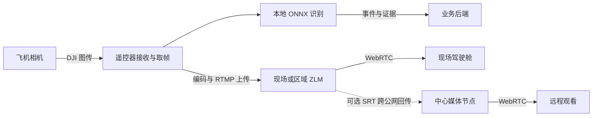

# 视频低延迟与多机带宽部署方案

日期：2026-09-05。审查基线：`main` / `ab6471d`。工作目录：`/Users/likewang/uavfire/.worktrees/m300-model-adaptation`。

本文保留对上述 main 基线源码、部署文件和官方接口资料的初始评估；没有连接现场服务器或遥控器，没有测得真实端到端延迟、可用带宽或多机容量。以下码率、余量、阈值均为设计起点，需要现场验证。

后续用户已选定 **20 路持续上传、最多 4 高清＋16 低清**，并授权新分支评审和实施。最终范围与进度以 [开发方案](video-bandwidth-development-design.md)、[实施计划](video-bandwidth-implementation-plan.md)、[评审记录](video-bandwidth-design-review.md) 为准。下文“无人观看可停流”等内容仅保留为早期备选，不属于本期策略；源码核验表描述的是实现前基线。

## 1. 建议结论

保留现有 RTMP 接入和 ZLMediaKit/WebRTC 播放基座，优先补齐源端码率控制、媒体连接核验、观看调度和监测。跨公网弱网明显时，再引入现场媒体节点及 SRT 回传，或评估遥控器原生实时推流方案。

多机接入的核心是：**本地持续识别、视频按需上传、重点画面高清、小窗低码率、媒体服务统一分发**。飞机在线数量、上传路数、每人观看路数和观看人数是四个不同的容量维度。即使协议更换，也无法让持续超过链路容量的视频实时送达。

本地 AI 能降低对中心视频回传的依赖，但当前取帧与推流生命周期仍有耦合，需要改造后才能保证“无上传、仍识别”。本地断网识别也不代表中心能在断网期间实时收到告警。

## 2. 当前项目核验结果

| 位置 | 已确认行为 | 对延迟和容量的影响 |
| --- | --- | --- |
| [DjiLiveStreamController.kt](../rcplus-msdk-agent/app/src/main/java/com/yinxin/uavfir/stream/DjiLiveStreamController.kt)，25–53 行 | 向 `live/{effectiveSn}-0` 推 RTMP；固定 `FULL_HD`；关闭音频；未显式设置码率模式和上限 | 当前业务没有按网络和观看角色分配上行码率；不能从 FULL_HD 枚举推断现场实际 Mbps |
| [RealMsdkStreamProvider.kt](../rcplus-msdk-agent/app/src/main/java/com/yinxin/uavfir/stream/RealMsdkStreamProvider.kt)，20–27、178–193 行 | 绑定本地视频后起流；停止时同时停上传和解绑；切镜头等操作停流、等待 800 ms 后重推 | 停推流省带宽不能直接调用现有整体 stop；切镜头造成的中断应与稳态网络延迟分开统计 |
| [OnDeviceFireDetectionCoordinator.kt](../rcplus-msdk-agent/app/src/main/java/com/yinxin/uavfir/firedetection/OnDeviceFireDetectionCoordinator.kt)，135–163 行 | 本地 ONNX 推理；运行中只保留一个待处理帧并更新它 | 已有防止推理帧无限排队的基础；仍需检验实际帧龄、处理耗时和遥控器温度/内存 |
| [FireEventIngestApi.kt](../rcplus-msdk-agent/app/src/main/java/com/yinxin/uavfir/firedetection/outbox/FireEventIngestApi.kt)，66–80、126–143 行 | 先上传证据，再发送带证据地址的正式事件；Outbox 支持重试 | 弱网下图片上传会影响中心事件到达时间；告警送达延迟需要独立于视频延迟监测 |
| [leadership-cockpit.vue](../frontend/src/pages/page-web/projects/leadership-cockpit.vue)，1299–1456 行 | ZLM WebRTC 播放；主窗和预览窗；连接故障重连 | 已有低延迟播放基础；当前播放代码未接入 getStats 或连续新帧监测，连接正常不等于画面新鲜 |
| [leadership-cockpit-live-layout.mjs](../frontend/src/pages/page-web/projects/leadership-cockpit-live-layout.mjs)，31–49 行 | 共享同一源时不重复建立预览画面 | 已有避免共享视频重复播放的策略，应保留；不能把双窗简单计成两条独立上行流 |
| [DualStreamServiceImpl.java](../backend/uavfire/src/main/java/com/yx/uavfire/manage/service/impl/DualStreamServiceImpl.java)，570–585 行 | 共享画面返回同一源 URL，并停止旧 FFmpeg 裁切 | 当前业务主路径未启动裁切转码；不能把遗留 StreamSplitterService 当作当前已确认的 CPU 瓶颈 |
| [config.ini](../deployment/zlmediakit/config/config.ini)、[docker-compose.yml](../deployment/zlmediakit/docker-compose.yml)、[README](../deployment/zlmediakit/README.md) | 配置 RTC 为 8000，README 却写 10000；Compose 同时映射了相关 UDP 端口；媒体地址有旧内网值；镜像默认使用 master | 存在部署说明漂移，但不足以断言当前现场端口错误；交付前统一配置入口并固定已验证媒体版本 |
| [Windows configure.ps1](../deployment/windows-offline/scripts/configure.ps1)，112–123 行 | 按 settings 生成 RTC 地址、UDP/TCP 端口 | Windows 应核对生成文件和进程实际加载路径；不能套用 Docker 示例端口 |

当前每架飞机通常是一条主流。M4T 单组件或共享画面不等于独立可见光、红外双流；未来确有双路时，按两路实际码率相加。

## 3. 延迟如何定位与解决



端到端视频延迟包含：机载采集/编码、DJI 空地链路、遥控器处理、上传排队与传输、媒体转发、浏览器抖动缓冲/解码/显示。`ping` 只测往返网络时间，不能代表这条总链路。

| 现场现象 | 优先核验 | 处理方向 |
| --- | --- | --- |
| 遥控器本地画面也迟滞 | 空地信号、干扰、遮挡、图传质量；UXSDK/推理/推流并发负载 | 先恢复本地图传及解码稳定；云服务器扩容无法修复这段问题 |
| 本地流畅，服务器收到的流已滞后 | 遥控器实际发送码率、共享 Wi-Fi/蜂窝上行、TCP 重传和发送队列 | 降低源端码率、保留链路余量、改善接入；必要时让 RTMP 只走现场 LAN |
| 服务器本地播放流畅，远端卡顿 | 媒体实际 ICE 候选地址、UDP/TCP、往返时间、丢包、客户端可用下载 | 修复直达媒体路径；按客户端带宽选择合适清晰度；跨区域就近分发 |
| 越看越落后 | 持续供给超过容量、编码/网络/解码积压 | 降低生产速率并有界处理队列；超时恢复到最新可解码关键帧，避免无限追旧帧 |
| 切镜头才黑屏或冻结 | 停推/800 ms 等待/重新推流/关键帧等待/重建播放 | 单独优化镜头切换状态机；减少无效切换和重复命令，不能直接盲删 SDK 排空等待 |
| 增加同屏窗口后卡顿 | 每页总码率、硬件解码并发、GPU/CPU、渲染 | 限制高清窗数量，缩略图用低码率源或定时图片，关闭离屏订阅 |

### 第一阶段：利用现有技术降低延迟

1. **Agent 显式控制码率。** 显式选择自动模式，并读取实际码率、帧率及状态；需要硬性总预算时，增加后台分配档位与 Agent 受控手动码率策略。不要假设 SDK AUTO 本身提供可配置的硬上限。DJI 提供 `setLiveVideoBitrateMode`、`setLiveVideoBitrate`，后者单位为 bit/s；文档说明默认模式为 MANUAL。设备组合和运行中切换效果仍需验证。[DJI 官方接口](https://developer.dji.com/api-reference-v5/android-api/Components/IMediaDataCenter/ILiveStreamManager.html)
2. **先降低上传分辨率/码率，再扩大缓存。** 初始试验档位可取：重点 1080p / 3–4 Mbps，普通 720p / 1–2 Mbps，小窗 540p / 0.4–0.8 Mbps；这些是目标档位，不是现有实测。SDK 内置质量档位采用固定帧率说明，不能承诺现有接口可任意设为 10/15 fps；低帧率缩略图需要额外编码或快照方案。巡林烟火细节对压缩敏感，观看档位变更不得未经验证降低本地 AI 输入质量。
3. **核对 WebRTC 媒体通道。** RTC 地址必须对播放器可达，UDP 端口、容器映射、NAT 和防火墙一致。网页/API 经 Nginx 成功不等于媒体可达；当前 Nginx 已关闭相关代理缓冲。受限网络可验证 TCP/TURN 回退，但回退会改变带宽路径和延迟，应可观测。[ZLM 配置说明](https://raw.githubusercontent.com/ZLMediaKit/ZLMediaKit/master/conf/config.ini)
4. **减少多余处理。** 兼容编码优先直接转发；需要转码时按“每源每档一次”共享，避免每名观众都转码。已有 `mergeWriteMS=0`，无需把重复设置它当作新的优化。关键帧间隔可先试约 1 秒，但必须确认编码器可控并观察突发码率；浏览器 H.264 兼容路径需核验 B 帧，不应直接套用 H.265 节省比例。[ZLM WebRTC 指南](https://docs.zlmediakit.com/zh/guide/protocol/webrtc/webrtc_compilation_and_use.html)
5. **控制共享出口排队。** 在可管理的现场网关上，对心跳、指令、事件元数据保留带宽，视频设总预算，证据/录像上传另设限速和并发。预算从高峰时段持续有效吞吐测得，而不是路由器标称速率；公共蜂窝网不保证执行现场 QoS 标记。

### 第二阶段：按部署网络选择媒体位置

| 部署场景 | 建议拓扑 | 效果与边界 |
| --- | --- | --- |
| 飞机和操作员同一现场 | 遥控器 → 现场 ZLM → 本地 WebRTC；服务器有线接交换机 | 本地观看不绕公网；多个遥控器仍共享 AP 无线空口，需按频段、干扰和实测容量规划 AP |
| 多个地点接中心 | 各地点就近接入媒体节点；远程按需回传重点流 | 故障隔离并减少无必要跨域传输；不同地点的独立上行应分别预算 |
| 蜂窝公网波动明显，能部署现场盒子 | 遥控器通过 LAN RTMP → 边缘盒子 → SRT → 中心 ZLM → WebRTC | 将抗丢包传输用于真正的公网段；只在云端收到 RTMP 后再转 SRT，不能修复前段已经产生的积压 |
| 无现场盒子，必须直接蜂窝推流 | 先测现有 SDK 降码率效果；再做 SDK 支持协议或自建编码帧推送的兼容性 PoC | 当前代码不是 SRT/WHIP 推送；不能仅改 URL 协议前缀；须验证 DJI 媒体资源、热负载与现有 AI 共存 |

SRT 通过接收缓冲和重传处理丢包，需为重传留带宽，并按 RTT/抖动配置延迟；它不会增加物理链路容量。自适应码率仍不可少。[SRT 官方 socket 选项](https://github.com/Haivision/srt/blob/master/docs/API/API-socket-options.md)

双运营商可改善可用性，但普通双 WAN 切换不等于单路视频带宽叠加。真正聚合需要支持多路径的网关和对端，或专门的视频多链路方案，也需验证乱序、切换和成本。

## 4. 多机的观看与上传策略

### 区分两类降码率

- **降低遥控器源端码率或停止上传**：节约现场上行，也改变该源所有观众能获得的最高画质。
- **中心生成低码率副本**：节约服务器向观众的出口和浏览器下载，不减少遥控器已经上传的源流。

因此，“小窗 CSS 缩小”不节省网络；“增加媒体服务器”也不会提高现场上行。WebRTC 转封装不会自动生成低清流；不同观众需要不同画质时，要由可支持的源端提供多档，或在媒体节点对每个源共享生成低清副本。

建议业务策略：

| 状态 | 上传/观看策略 |
| --- | --- |
| 在线、无人查看、无取证录像任务 | 保持本地 AI 和遥测；可停视频上传或维持低码率预览，取决于首帧时延要求 |
| 多画面巡查 | 普通窗口低清；首版可限制每页 1 个高清重点窗，其他窗口低清或快照 |
| 被选中、发生火情、需要复核 | 优先获得高清预算；拥塞时先减少非重点流，避免所有飞机同时升高清 |
| 录像或其他系统订阅中 | 即使网页无人观看，也不能仅凭 reader=0 停源；将录像和业务任务计入有效需求 |
| 无人查看超过宽限期 | 在无其他任务占用时撤销上传租约；建议先试 20–30 秒宽限，避免点选抖动频繁起停 |

需增加服务端订阅租约、引用计数、优先级和总码率分配；按飞机/相机/节点识别唯一源。一名观众关窗只能释放自己的订阅，不能停止其他观众仍需的流。使用带 generation/过期时间的命令和 ACK，避免滞后的降清/停流命令覆盖新请求。

每架飞机只上传一次至其媒体接入节点，观众由媒体服务器分发；不要为多个观看者启动多个遥控器上传。多个地点可分配不同接入节点；使用流归属和容量信息进行分配，已有媒体会话保持在所属节点，不能把普通 HTTP 轮询负载均衡直接当作媒体集群。

当前 `agentAircraftSn` 默认为空，可用动态身份；批量部署时避免把同一固定飞机 SN 写进通用 APK，造成多个 Agent 发布到相同流名。

### 保持本地识别和告警通道

先将相机取帧、本地识别、网络上传三个生命周期拆开，使上传断开或后台收回视频预算不解绑 AI 帧消费者。验证 RTMP 停止、弱网、断网重连时仍有新鲜输入帧和本地检测结果，并保留现有机型/载荷能力门禁。

现有正式事件先上传证据。如果业务要求更快获知疑似火情，可另行设计“待证据核验的先行通知 → 同一 eventId 补证据 → 正式确认”，保留鉴权、防重放和后端证据校验，不能直接跳过现有正式事件验证。证据上传应去重、限并发并避免堵塞较小的状态/告警消息。

## 5. 带宽计算与算例

定义：`b_i` 为第 i 条实际上传流的码率，`b_ij` 为该流向第 j 名观众发送的码率，单位均为 Mbps。`k` 代表协议开销和一般重传的估算系数，初算取 1.25；`u` 为规划最高持续利用率，初算取 0.70。它们是两个不同因素：一个补开销，一个保留拥塞余量，弱网重传严重时需要重新测定。

```text
媒体节点入站实际流量预算 = k × Σ b_i
媒体节点出站实际流量预算 = k × Σ b_ij
各方向建议可用容量       = 对应流量预算 / u
单个浏览器下载预算       = k × 该浏览器实际订阅的全部码率
```

节点容量要分别看入站、出站和链路路径，不直接把全双工两方向相加当作单向瓶颈。TURN、跨节点分发、远端录像、图片和其他业务需要按实际经过的链路另计。

以下示例假设所有飞机共用同一上行/媒体接入口：

| 示例策略 | 原始视频合计 | 含 25% 开销 | 按 70% 利用率规划的可用容量 |
| --- | ---: | ---: | ---: |
| 10 架，每架 4 Mbps | 40 Mbps | 50 Mbps | 约 72 Mbps |
| 20 架，每架 4 Mbps | 80 Mbps | 100 Mbps | 约 143 Mbps |
| 20 架，每架 2 Mbps | 40 Mbps | 50 Mbps | 约 72 Mbps |
| 20 架，4 路重点各 4 Mbps，16 路各 0.5 Mbps | 24 Mbps | 30 Mbps | 约 43 Mbps |
| 20 架本地识别，只上传 2 路重点各 4 Mbps | 8 Mbps | 10 Mbps | 约 15 Mbps，另加事件/图片等业务 |

最后两行是改造后的策略示例，当前尚无自动总预算调度；末行需先完成本地取帧与停上传解耦。

**观看者放大效应：** 20 路 × 4 Mbps × 5 名观众全部观看 = 400 Mbps 原始媒体出口；含开销为 500 Mbps，按上述余量需约 715 Mbps 可用出口。若每人只看“1 路 4 Mbps 重点 + 8 路 0.5 Mbps 小窗”，每人约 10 Mbps，5 人合计约 50 Mbps，建议可用出口约 72 Mbps。若低清流来自中心转码，现场上行仍按原始上传流计算。

4 Mbps 持续一小时约 1.8 GB 视频数据；20 路约 36 GB/小时，均未计协议和重传。录像存储和公网出口计费应单列，多位观众还会增加分发流量。

## 6. 落地顺序和验收

| 优先级 | 改动包 | 完成判断 |
| --- | --- | --- |
| P0 | 统一媒体地址/端口来源、固定媒体版本；采集实际码率和媒体连接统计 | 能辨别问题在空地、上传、服务器或浏览器；确认现场实际配置而非只看模板 |
| P0 | Agent 显式码率策略和实际质量反馈 | 可选档位、可回读实际值、弱网不无限排队，推理质量不因直播降档意外下降 |
| P1 | 本地取帧/AI/上传解耦；观看订阅租约及优先级预算 | 无人观看可停上传且继续本地检测；关一个窗口不影响其他观众；多机抢带宽有明确降级顺序 |
| P1 | 浏览器状态统计、低清订阅、离屏释放和单路恢复 | 不把 connected 当作已出新帧；受损流单独恢复，避免连带重建健康流 |
| P2 | 有需求的源共享生成低清副本，限制编码工作数 | 测出每台转码节点容量；达到上限时拒绝/降级而非堆积队列 |
| P2 | 现场/区域接入节点、按需 SRT 回传、媒体节点分配 | 跨公网弱网和节点切换有可复现结果；源端上行与中心分发分别满足预算 |

浏览器按 1–2 秒间隔采样 `getStats()`：实际接收码率、丢包变化、解码帧率、冻结次数/时长、ICE 路径、RTT，以及 `ΔjitterBufferDelay / ΔjitterBufferEmittedCount` 得到区间平均抖动缓冲时间。计数器应按差分使用、处理归零及无新帧；API 字段缺失时降级，不能当作零。`getStats()` 的缓冲时间和 RTT 不等于端到端视频延迟。[W3C WebRTC 统计规范](https://www.w3.org/TR/webrtc-stats/)

端到端用相机拍摄毫秒计时器，并在同一拍摄画面中记录计时器与播放端显示作比较；或使用经过同步校验的采集时间戳链。只在遥控器端加时间戳会漏掉飞机到遥控器的延迟。分别记录稳定播放、冷启动首帧、切镜头恢复、断网恢复和事件送达。

建议先以以下工程目标组织测试，不能写成现有能力承诺：

- 现场 LAN 稳态视频 P95 ≤ 800 ms；正常蜂窝公网 P95 ≤ 1.5 s。若飞机到遥控器本身已耗尽预算，先测出并调整分段目标。
- 连续 30 分钟无持续增长的播放落后；测试报告列出冻结比例和最大冻结时长，不能只给平均延迟。
- 以 1/4/10/20 路或实际目标数进行阶梯压测；观众数、每人窗口数和清晰度另行变化，记录服务器入/出站、CPU/GPU/内存及浏览器解码负载。
- 在隔离测试网络注入 50/100/200 ms RTT、0/1/3/5% 丢包及限速，观察降档、告警到达、恢复和 Outbox；不在实飞控制链路直接做故障注入。
- 发生卡流、停上传、APP 页面切换时，单独验证本地 AI 输入帧仍更新；正式事件、证据补传和机型/载荷能力按各自验收条件判断。

离线视频压测只能证明服务器分发和客户端容量；真实遥控器、真实无线环境、UXSDK/ONNX/直播并发及受控飞行仍需单独验证。

## 7. 待补充的现场信息

同时在线飞机数、同时上传数、独立可见光/红外路数、每人同屏数、观看人数；服务器位置；遥控器接入方式；高峰持续上行/下行有效吞吐；是否全量录像；可接受的视频延迟与告警送达时间。得到这些信息后，将第 5 节示例替换成各地点、各方向的实际容量表，再确定服务器规格与链路采购。
